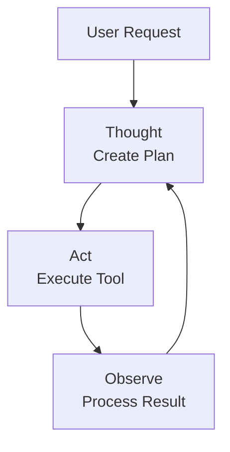
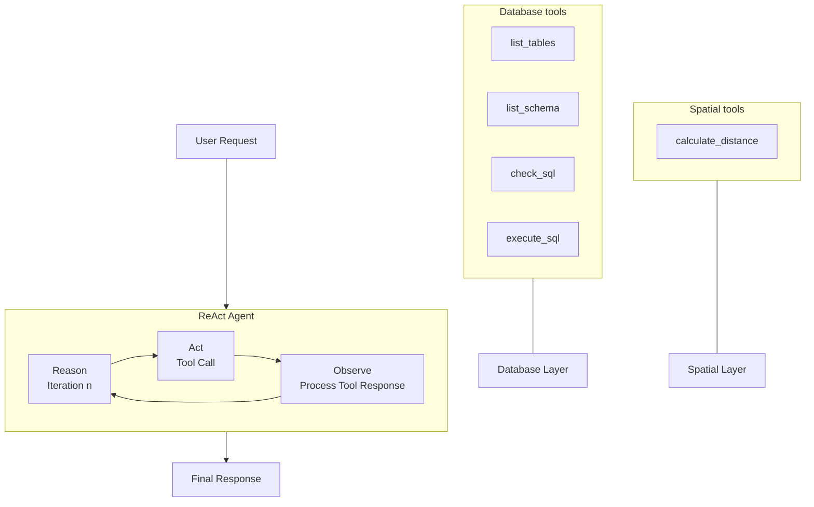
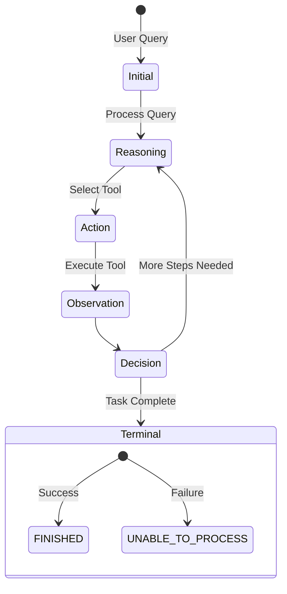

# ReAct Agentic Pattern Demo


A demonstration of the **ReAct** (Reason + Act) agentic pattern using OpenAI's API for complex query operations. This agent intelligently formulates plans, executes actions, and observes results to complete tasks.

## 📋 Table of Contents

- [Features](#features)
- [Quick Start](#quick-start)
- [Installation](#installation)
- [Usage](#usage)
- [How REACT Works](#how-the-react-process-works)
- [Example Output](#example-output)
- [Project Structure](#project-structure)
- [Troubleshooting](#troubleshooting)

## ✨ Features

- Implements the **ReAct** pattern (Reason, Act, Observe)
- Performs SQL operations via specialized Tool calling
- Processes user requests from configurable JSON file
- Handles complex multi-step reasoning tasks
- Calculates geographic data including distances between locations

## 🚀 Quick Start

```bash
# Clone and install
git clone git@github.com:Ali-932/ReAct-Agent-Demo.git
cd ReAct-Agent-Demo
python -m venv venv && source venv/bin/activate
pip install -r requirements.txt

# Configure
cp .example.env .env
# Edit .env with your OpenAI API key

# Setup database
python setup/populate_db.py

# Run
python main.py --model "gpt-4o" --temperature 0.3 --num_steps 10
```

## 📦 Installation

### Prerequisites

- Python 3.8+
- OpenAI API key

### Dependencies

```
openai
pydantic
python-dotenv
```

### Setup Steps

1. **Clone the repository**
   ```bash
   git clone git@github.com:Ali-932/ReAct-Agent-Demo.git
   cd ReAct-Agent-Demo
   ```

2. **Create and activate a virtual environment**
   ```bash
   python -m venv venv
   source venv/bin/activate  # On Windows: venv\Scripts\activate
   ```

3. **Install dependencies**
   ```bash
   pip install -r requirements.txt
   ```

4. **Configure OpenAI API key**
   ```bash
   cp .example.env .env
   # Edit the .env file with your API key
   ```

5. **Initialize the database**
   ```bash
   python setup/populate_db.py
   ```

6. **Customize user prompts**  
   Edit `user_prompts.json` with your desired queries:
   ```json
   {
     "user_requests":[
       "What is the distance between los angeles and new york?",
       "What is the closest city to latitude 34.0 and longitude -118.0?",
       "What is the weather like in the closest city to latitude 40.0 and longitude -75.0 on 2025-03-14?"
     ]
   }
   ```

## 🔧 Usage

Run the demo with these customizable parameters:

```bash
python main.py --model "gpt-4o" --temperature 0.3 --num_steps 10
```

### Parameters

| Parameter | Description | Example |
|-----------|-------------|---------|
| `--model` | OpenAI model to use | `"gpt-4o"`, `"gpt-4o-mini"` |
| `--temperature` | Randomness (0.0-1.0) | `0.3` (lower = more deterministic) |
| `--num_steps` | Maximum iterations | `10` |


## 🧠 How ReAct Agents Work

### Step Structure


### Conceptual Framework

The ReAct pattern (Reason-Act-Observe) follows a cognitive loop inspired by human problem-solving strategies:

1. **Reason**: The agent analyzes information, evaluates options, and forms hypotheses about what actions to take next
2. **Act**: Based on reasoning, the agent selects and executes a specific Tool or action
3. **Observe**: The agent examines the results of the action to update its understanding
4. **Loop**: This cycle repeats until the task is complete

### Implementation Flow



### Decision Architecture

Each REACT step includes:

- **Status**: Current workflow state (`FINISHED`, `IN-PROGRESS`, or `UNABLE TO PROCESS USER REQUEST`)
- **Observation**: Results from previous tool calls
- **Thought**: Reasoning for the next action
- **Confidence**: Model's certainty level (0.0-1.0)
- **Iteration**: Current step number
- **Tool-call**: Formatted API call with appropriate arguments


### Complete Execution Diagram



### Output State Machine


### Output Schema

```json
{
  "schema": {
    "type": "object",
    "properties": {
      "iteration": {"type": "integer"},
      "observation": {"type": "string"},
      "thought": {"type": "string"},
      "confidence": {"type": "number"},
      "status": {
        "type": "string",
        "enum": ["IN-PROGRESS", "FINISHED", "UNABLE TO PROCESS USER REQUEST"]
      }
    }
  }
}
```

This architecture allows the agent to tackle complex multi-step problems by breaking them down into manageable subproblems and systematically working toward solutions.


## 📝 Example Output

```
What is the distance between los angeles and new york?
==================== STEP 1 ====================
STATUS: IN-PROGRESS
TIME: 21:49:07
OBSERVATION:
THOUGHT: To calculate the distance between Los Angeles and New York, I first need to understand the database structure, then get their coordinates, and finally calculate the distance.
CONFIDENCE: 0.90
Action : list_tables
==================== STEP 2 ====================
STATUS: IN-PROGRESS
TIME: 21:49:09
OBSERVATION: The database contains four tables: cities, distances, transportation, and weather.
THOUGHT: Now I need to check the schema of the cities table to find location coordinates.
CONFIDENCE: 0.90
Action : list_table_schema
==================== STEP 3 ====================
STATUS: IN-PROGRESS
TIME: 21:49:12
OBSERVATION: The cities table has columns for id, name, country, latitude, and longitude.
THOUGHT: Now I'll create and check a SQL query to get the coordinates for Los Angeles.
CONFIDENCE: 0.90
Action : check_sql
==================== STEP 4 ====================
STATUS: IN-PROGRESS
TIME: 21:49:15
OBSERVATION: The SQL query for Los Angeles's coordinates is valid.
THOUGHT: Now I can execute the query to get Los Angeles's coordinates.
CONFIDENCE: 0.90
Action : execute_sql
==================== STEP 5 ====================
STATUS: IN-PROGRESS
TIME: 21:49:17
OBSERVATION: Retrieved coordinates for Los Angeles: latitude 34.0522, longitude -118.2437.
THOUGHT: Now I need to get the coordinates for New York.
CONFIDENCE: 0.90
Action : check_sql
==================== STEP 6 ====================
STATUS: IN-PROGRESS
TIME: 21:49:20
OBSERVATION: The SQL query for New York's coordinates is valid.
THOUGHT: Now I can execute the query to get New York's coordinates.
CONFIDENCE: 0.90
Action : execute_sql
==================== STEP 7 ====================
STATUS: IN-PROGRESS
TIME: 21:49:23
OBSERVATION: Retrieved coordinates for New York: latitude 40.7128, longitude -74.0060.
THOUGHT: Now I can calculate the distance between these two sets of coordinates.
CONFIDENCE: 0.90
Action : calculate_distance
==================== STEP 8 ====================
STATUS: FINISHED
TIME: 21:49:25
OBSERVATION: The distance between Los Angeles and New York is approximately 3935.75 kilometers.
THOUGHT: I have successfully calculated the distance between Los Angeles and New York.
CONFIDENCE: 1.00 

Final answer : The distance between Los Angeles and New York is approximately 3935.75 kilometers.
```

## ❓ Troubleshooting

**API Key Issues**
- Ensure your OpenAI API key is correctly set in the `.env` file
- Verify your OpenAI account has sufficient credits

**Database Errors**
- Run `python setup/populate_db.py` again to reset the database
- Check for error messages during database initialization

**Tool Call Failures**
- Verify network connectivity
- Check that your prompt follows expected format

---

**Note**: This repository is for demonstration purposes to showcase the REACT agentic pattern. For production use, additional error handling and security measures are recommended.
